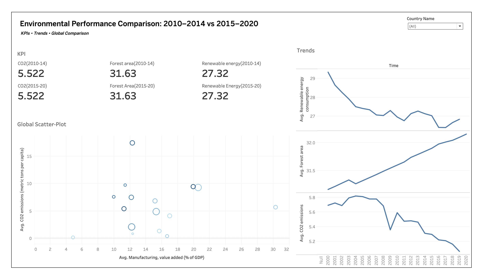
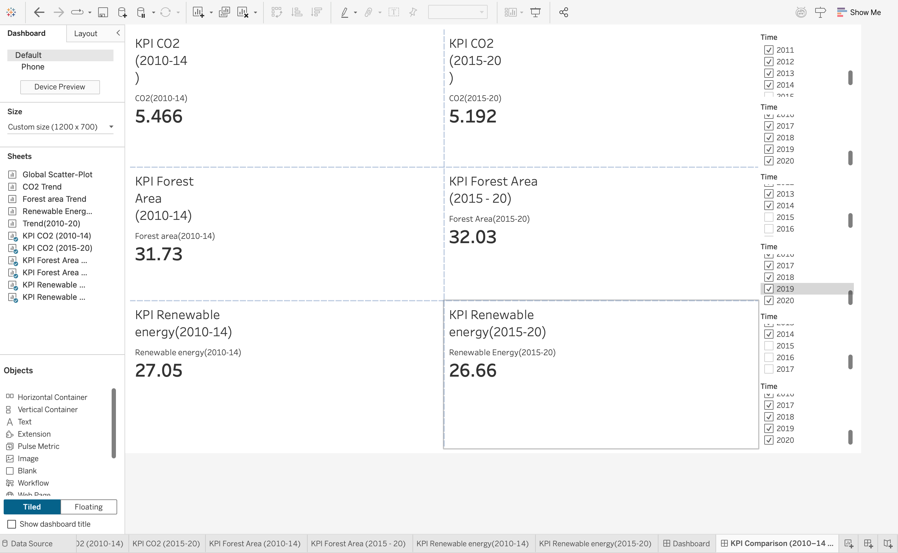
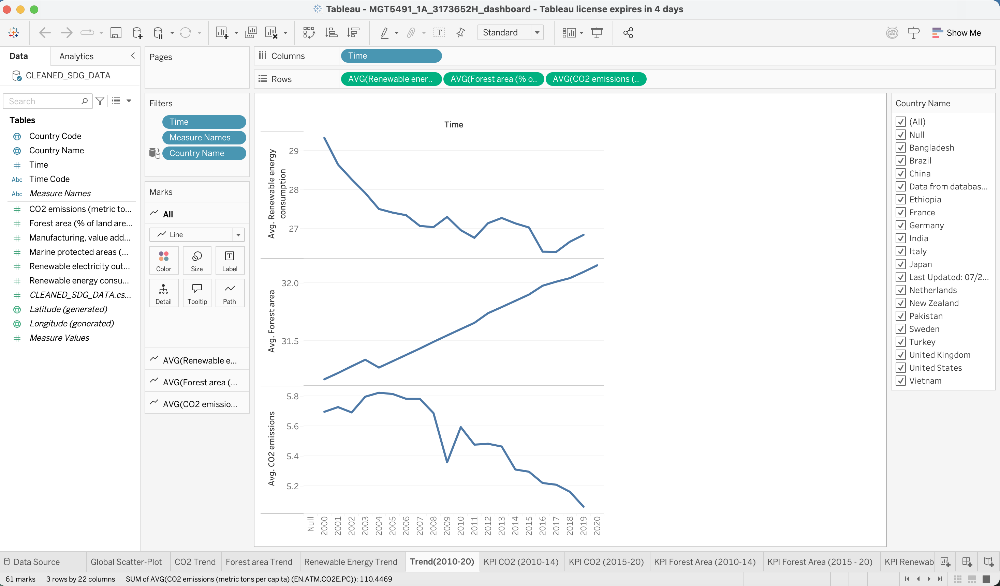
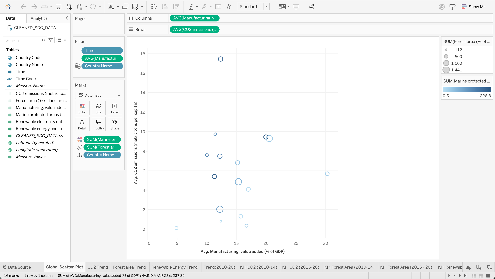

# Sustainability Analysis Dashboard (Tableau)

This project presents a Business Intelligence dashboard analysing global sustainability indicators using Tableau and World Bank SDG data.

## Objective
To compare environmental performance across countries before and after the introduction of Sustainable Development Goals (SDGs), focusing on emissions, renewable energy usage, and forest coverage.

## Key Metrics Analysed
- CO₂ emissions (metric tons per capita)
- Renewable energy consumption (%)
- Forest area (% of land area)
- Manufacturing value added (% of GDP)

## Dashboard Overview

## KPI Comparison (Pre vs Post SDGs)

## Trend Analysis

## Global Comparison

## Tools & Skills Used
- Tableau (Dashboards, KPIs, Filters, Calculated Fields)
- Data Cleaning & Aggregation
- Time-based Comparison Analysis
- Business & Sustainability Analytics

## Files
- `sustainability_dashboard.twbx` – Tableau packaged workbook
